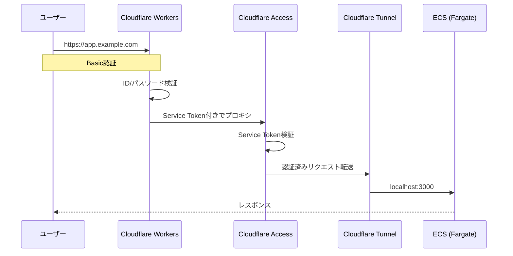
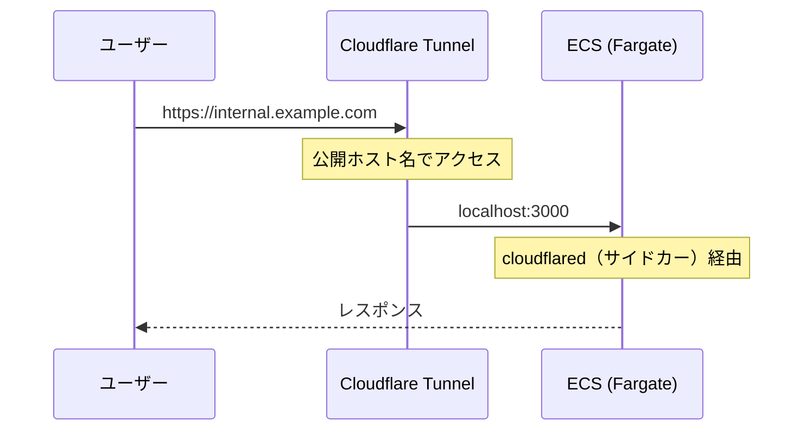
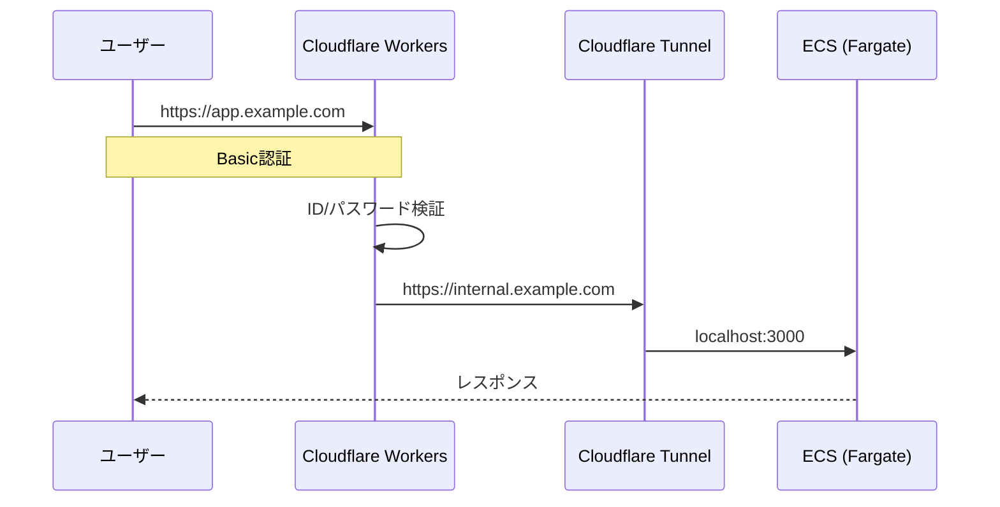

## はじめに

最近、AWSのBedrock（生成AIサービス）を使ってAIアシスタント機能付きの講義アプリを作成しました。低頻度で稼働させる想定のため手軽に起動・停止したい、将来的な移植性は確保したいと考え、ECS(Fargate)で構築してあります。

さて、Bedrockは呼び出しごとに課金されるため、予期しないアクセスでAPIが叩かれ続けるとコストがとんでもなく膨らみます。認証は必須です。

ただ、今回の用途における認証には以下の考慮事項がありました。

- アプリは特定の講義の出席者向けに公開するが、出席者は毎回流動的。事前にメールアドレスを把握したり、全員が共通のIDプロバイダー(Google, GitHubなど)を利用可能なことを期待したりするのは難しい。
- とにかく低コスト。

使わないときには停止するサービスということもあり、ある程度のリスクは許容可能であることを考慮すると、例えばBasic認証で、講義実施時にログイン情報を共有することも選択肢としては入ってきます。パスワードは講義ごとに使い捨てで変更する運用とすれば、漏洩時の影響も限定的です。

では、**ECS上のアプリを安全に公開しつつ、お安くBasic認証をかけるにはどうすれば？**
本記事では、この制約をクリアするために実際にやったことを、道中での気付きも含めて紹介します。

## 本記事の結論

先に結論をお見せします。最終的に以下の構成に辿り着きました。

| 課題 | 解決策 |
|---|---|
| IdPに依存しない簡易な認証が必要 | Cloudflare WorkersでBasic認証 |
| セキュアにアプリを公開したい | Cloudflare Tunnel（無料） |
| Tunnel URLへの直接アクセスを防ぐ | Cloudflare Access + Service Token |



| コンポーネント | 役割 |
|---|---|
| Cloudflare Workers（Hono） | Basic認証のゲートウェイ |
| Cloudflare Access + Service Token | TunnelへのWorker以外のアクセスを禁止 |
| Cloudflare Tunnel（cloudflared） | ECS(Fargate)とCloudflareを安全につなぐ |
| ECS (Fargate) | アプリ本体 |

:::message
本文では触れますが、本章用にCloudflareの各サービスについて簡単に補足します。
- **Cloudflare Tunnel**: サーバーとCloudflareの間にトンネルを張るサービス。Tunnel側で公開ホスト名（例：`internal.example.com`）を設定でき、そのホスト名へのアクセスがトンネル経由でサーバーに届く。サーバー側にパブリックIPやロードバランサーが不要になる。
- **Cloudflare Workers**: Cloudflareのエッジで動くサーバーレス関数。リクエストの加工やルーティングに使える。
- **Cloudflare Access**: アプリケーションへのアクセスをポリシーベースで制御するゼロトラスト認証サービス。
:::

以降のセクションでは、この構成に至るまでの経緯を述べたうえで、各コンポーネントのセットアップも紹介します。

## この記事の対象読者

- ECS (Fargate) で稼働するアプリをセキュアかつ低コストに公開したい人
- Cloudflare のサービスをこれから活用してみたい人

## この記事で扱わないこと

- Cloudflare/AWSアカウントの初期設定
- IaCでの構成管理方法（Terraform, CDK等）

## ALBなしで安全に公開・認証したい

認証付きでECSのアプリを公開しようと思った時に、まず思いつくのが定番構成のALB + Cognitoです。ALBでアプリを公開し、Cognitoで認証をかけます。ECSタスク側ではセキュリティグループでALBからのInboundを許可しておきます。

しかしALBには約$20〜/月の固定費がかかります。「お安く」という要件に対して、これは厳しい。

今回のアプリは講義のときだけ使うもので、稼働頻度は月に数回程度です。「講義のときだけALBを立てればよい」という考えもありますが、IaCで管理していたとしても講義のたびにapply/destroyを実施するのは運用コストとして無視できません。

**AWSの中だけで解決策を探すと、ALBを使わずに安全な公開と認証を両立する方法がなかなか見つからない。** ここで行き詰まりました。

## Cloudflare Tunnelとの出会い

AWSの外に目を向けたところ、**Cloudflare Tunnel**の存在を知りました。

Cloudflare Tunnelは、サーバー側からアウトバウンドでCloudflareのネットワークに接続を張る仕組みです。従来のリバースプロキシとは逆方向で、サーバーからCloudflareに向かってトンネルを掘ります。

これがECSとの相性が抜群でした。サーバー側からのアウトバウンド接続だけで成立するため、セキュリティグループのInboundを完全に閉じることができます。先ほどのALB構成で必要だったInboundの設定も不要です。さらに、Tunnelのクライアントである`cloudflared`はコンテナイメージが公式に提供されており、ECSのサイドカーコンテナとして容易に導入できます。しかも無料利用枠で使えます。

この時点での構成イメージは次の通りです。



ALBなしでアプリを公開できる見通しが立ちました。しかし、まだ認証がありません。

## Tunnelに認証をかける

Cloudflare Tunnelには**Cloudflare Access**という認証機能を組み合わせることができます。AccessではメールによるOTP（ワンタイムパスワード）認証やIdP連携（Google, GitHubなど）といった認証方式が用意されています。

しかし、今回の要件を思い出してみましょう。参加者は毎回流動的で、全員が共通のIdPを利用できるとは限らず、メールを受信できる環境にあるとも限りません。今回の用途であればBasic認証を使っておきたいところです。

**残念ながら、Cloudflare AccessにはBasic認証の機能がありません。**

そこで目を付けたのが**Cloudflare Workers**です。Workersはエッジで動くサーバーレス関数で、Tunnelの公開ホスト名の前段にプロキシとして配置できます。WorkersでBasic認証を実装し、認証を通過したリクエストだけをTunnelの公開ホスト名に転送する構成です。こちらも無料枠で十分です。



## 落とし穴：Tunnel URLは丸見えだった

Workers + Tunnelの構成で認証の問題も解決……ではありません。

Cloudflare TunnelのPublic Hostnameに設定したURL（例：`internal.example.com`）は、**デフォルトでインターネットに公開されます**。つまり、Workersで「Basic認証を通過したリクエストだけをTunnelにプロキシする」構成にしても、Tunnel URLを知っている人はWorkersを経由せず、つまりBasic認証なしでアプリにアクセスできてしまいます。危ない。

ここで再びCloudflare Accessの出番です。前のセクションではユーザー向けの認証機能として紹介しましたが、Accessにはもう一つ、**Service Token**という機械的なアクセス制御の機能があります。AccessのポリシーでTunnelへのアクセスを「特定のService Tokenを持つリクエストのみ」に制限できます。Service TokenをWorkersだけに持たせれば、Tunnel URLを直叩きされても403で弾かれます。

こうして、Workers → Access → Tunnelの**3段構成**に辿り着きました。改めて構成図を再掲します。


ついにやりたいことを実現可能な構成が見えました！

次の章からは、この構成を作成するための具体的なセットアップに触れていきます。

## セットアップ

それでは各コンポーネントのセットアップを見ていきましょう。

### Cloudflare Tunnelの作成

[Cloudflare Zero Trust Dashboard](https://one.dash.cloudflare.com/) → Networks → Tunnels → Create a tunnel から作成します。

| 項目 | 値 |
|---|---|
| コネクタタイプ | Cloudflared |
| トンネル名 | 任意（例: `my-app-tunnel`） |

作成後に表示されるTUNNEL_TOKENをコピーしておきます。後でECSのタスク定義で使います。

#### Public Hostnameの設定

同じトンネルの設定画面でPublic Hostnameを追加します。

| 項目 | 値 |
|---|---|
| Subdomain | `internal`（例） |
| Domain | 自分がCloudflare上で管理しているドメイン |
| Service | HTTP |
| URL | `localhost:3000`: ECS上のアプリが公開しているホスト・ポート |

これで`https://internal.example.com`がTunnelのURLになります。このURLはWorkerからのみアクセスさせる非公開エンドポイントです（前述のAccessで保護します）。

### Cloudflare AccessでTunnelを保護

#### Service Tokenの作成

まずService Tokenを作成しておきます。後のAccess Applicationのポリシー設定で使います。

Zero Trust Dashboard → Access controls → Service credentials → Service Tokens → Create Service Token から作成します。

| 項目 | 値 |
|---|---|
| 名前 | 任意（例: `my-app-worker`） |
| 有効期限 | 用途に応じて設定 |

作成後に表示される以下の2つの値をコピーしておきます。

- `CF-Access-Client-Id`
- `CF-Access-Client-Secret`

:::message
`CF-Access-Client-Secret`は作成時にしか表示されません。必ずこのタイミングでコピーしてください。
:::

#### Access Applicationの作成

Zero Trust Dashboard → Access controls → Applications → Add an application → Self-hosted を選択します。

| 項目 | 値 |
|---|---|
| App name | 任意（例: `my-app-tunnel`） |
| Domain | `internal.example.com`（TunnelのPublic Hostname） |

ポリシーを追加します。

| 項目 | 値 |
|---|---|
| Policy name | 任意 |
| Action | Service Auth |
| Include | 先ほど作成したService Token |

ポイントはService Authを選ぶことです。これにより、IdP（Google等）によるログインフローではなく、Service Tokenによる機械的な認証のみを受け付けます。

### Cloudflare WorkersでBasic認証プロキシを実装

認証プロキシの実装には[Hono](https://hono.dev/)を使いました。TypeScript対応でCloudflare Workersとの相性が良いフレームワークです。

やることはシンプルで、すべてのリクエストにBasic認証を適用し、認証を通過したリクエストをService Token付きでTunnelホストにプロキシします。

```typescript
import { Hono } from 'hono'
import { basicAuth } from 'hono/basic-auth'
import { proxy } from 'hono/proxy'

type Bindings = {
  BASIC_USER: string
  BASIC_PASS: string
  TUNNEL_HOST: string
  CF_CLIENT_ID: string
  CF_CLIENT_SECRET: string
}

const app = new Hono<{ Bindings: Bindings }>()

// すべてのリクエストにBasic認証を適用
app.use('*', async (c, next) => {
  const auth = basicAuth({
    username: c.env.BASIC_USER,
    password: c.env.BASIC_PASS,
  })
  return auth(c, next)
})

// 認証通過後、TunnelホストへプロキシしてService Tokenを付与
app.all('*', (c) => {
  const url = new URL(c.req.url)
  return proxy(`${c.env.TUNNEL_HOST}${url.pathname}${url.search}`, {
    ...c.req,
    headers: {
      ...c.req.header(),
      Authorization: undefined,
      'CF-Access-Client-Id': c.env.CF_CLIENT_ID,
      'CF-Access-Client-Secret': c.env.CF_CLIENT_SECRET,
    },
  })
})

export default app
```

ポイントは2つです。

- `Authorization: undefined`でBasic認証ヘッダーを除去しています。Tunnel側にBasic認証の情報を転送する必要はなく、意図しない挙動を防ぐためにも除去が適切です
- 環境変数はすべてCloudflare WorkersのSecrets（`wrangler secret put`）で管理します。コードにべた書きしないようにしましょう（当たり前ですが大事）

Secretsの設定コマンドは以下の通りです。

```bash
wrangler secret put BASIC_USER
wrangler secret put BASIC_PASS
wrangler secret put TUNNEL_HOST   # 例: https://internal.example.com
wrangler secret put CF_CLIENT_ID
wrangler secret put CF_CLIENT_SECRET
```

### ECSタスクにcloudflaredをサイドカーとしてデプロイ

`cloudflared`をサイドカーコンテナとしてアプリコンテナと同じタスクで動かします。同一タスク内のコンテナはlocalhostで通信できるため、cloudflaredから`localhost:3000`でアプリにアクセスできます。

以下はECSタスク定義の例です。

```json
{
  "family": "my-app",
  "networkMode": "awsvpc",
  "requiresCompatibilities": ["FARGATE"],
  "cpu": "512",
  "memory": "1024",
  "executionRoleArn": "arn:aws:iam::ACCOUNT_ID:role/ecsTaskExecutionRole",
  "containerDefinitions": [
    {
      "name": "app",
      "image": "ACCOUNT_ID.dkr.ecr.ap-northeast-1.amazonaws.com/my-app:latest",
      "essential": true,
      "portMappings": [
        { "containerPort": 3000, "protocol": "tcp" }
      ],
      "logConfiguration": {
        "logDriver": "awslogs",
        "options": {
          "awslogs-group": "/ecs/my-app",
          "awslogs-region": "ap-northeast-1",
          "awslogs-stream-prefix": "app"
        }
      }
    },
    {
      "name": "cloudflared",
      "image": "cloudflare/cloudflared:latest",
      "essential": true,
      "command": ["tunnel", "run"],
      "secrets": [
        {
          "name": "TUNNEL_TOKEN",
          "valueFrom": "arn:aws:secretsmanager:ap-northeast-1:ACCOUNT_ID:secret:my-app/tunnel-token"
        }
      ],
      "dependsOn": [
        { "containerName": "app", "condition": "START" }
      ],
      "logConfiguration": {
        "logDriver": "awslogs",
        "options": {
          "awslogs-group": "/ecs/my-app",
          "awslogs-region": "ap-northeast-1",
          "awslogs-stream-prefix": "cloudflared"
        }
      }
    }
  ]
}
```

TUNNEL_TOKENはAWS Secrets Managerで管理します。

```bash
aws secretsmanager create-secret \
  --name "my-app/tunnel-token" \
  --secret-string "your-tunnel-token"
```

:::message
ECSタスク定義の`secrets`でSecrets Managerの値を参照するには、`executionRoleArn`に指定するIAMロールに`secretsmanager:GetSecretValue`の権限が必要です。対象リソースは当該シークレットのARNに絞りましょう。
:::

#### セキュリティグループの設定

cloudflaredはアウトバウンドでCloudflareに接続するため、**Inboundルールは不要**です。

| 方向 | 設定 |
|---|---|
| Inbound | なし（全閉じ） |
| Outbound | 許可（cloudflaredのアウトバウンド通信のため） |

:::message
コストを追求してFargateをパブリックサブネットにデプロイしてInboundを全閉じにする選択肢があります。どこまでセキュリティを追求するか秤にかけて選択しましょう。プライベートサブネットの場合はcloudflaredのアウトバウンド通信のためにNAT Gatewayが必要になる点は要考慮です。
:::

## コスト比較

| 構成 | 月額概算 |
|---|---|
| Fargate + ALB + Cognito | ALB: $20〜/月 + Fargate代 + α |
| **本構成（Fargate + Cloudflare）** | **Fargate代** + α |

Cloudflare Tunnel・Workers・Accessはいずれも今回の用途では無料枠で運用できました。

## おわりに

AWSの中だけで解決策を探して行き詰まっていたのですが、Cloudflareのエコシステムに目を向けたことで、ALBなしでECS上のアプリをセキュアに公開する構成に辿り着けました。

Tunnel + Access + Workersの組み合わせは、それぞれが無料で使えるにもかかわらずアクセス制御を実現できます。同じような課題をお持ちの方の参考になれば嬉しいです。

## 補足：AWS内で完結させる場合

「Cloudflareを使わず、AWS内で完結させられないの？」という疑問もあるかと思います。候補に挙がるのは**CloudFront + CloudFront Functions**の組み合わせです。CloudFront FunctionsでBasic認証を実装し、オリジンとしてECSタスクを指定する構成ですね。

しかし、ここで問題にぶつかります。**CloudFrontのオリジンにはドメイン名を指定する必要があり、IPアドレスは直接指定できません。** 一方、ECS (Fargate)のタスクに割り当てられるパブリックIPはタスクが再起動するたびに変わります。安定したドメイン名を持たないECSタスクをCloudFrontのオリジンに据えること自体が困難なのです。

ECSタスクに安定したエンドポイントを与える方法としては、ALBの他にもAPI Gateway + VPC Link + NLBという構成が考えられます。ただし、NLBの固定費やVPC Linkの設定など、コストと複雑性がそれなりに上がります。

今回の「とにかく低コスト」という要件のもとでは、AWS内だけで完結させるのは難しいと判断しました。これが、本記事でCloudflare Tunnelを採用した理由のひとつです。

## 参考

- [Cloudflare Tunnel ドキュメント](https://developers.cloudflare.com/cloudflare-one/networks/connectors/cloudflare-tunnel/)
- [Cloudflare Access - Service tokens](https://developers.cloudflare.com/cloudflare-one/access-controls/service-credentials/service-tokens/)
- [Cloudflare Access - Policies](https://developers.cloudflare.com/cloudflare-one/access-controls/policies/)
- [Publish a self-hosted application to the Internet](https://developers.cloudflare.com/cloudflare-one/access-controls/applications/http-apps/self-hosted-public-app/)
- [Hono - Cloudflare Workers](https://hono.dev/docs/getting-started/cloudflare-workers)
