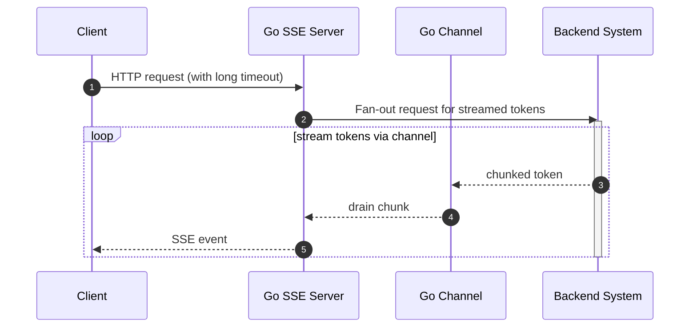

この記事は[Goアドベントカレンダー2025]()に参加しています。

## はじめに
**SSE(Server-Sent Events)**、いろいろなところで見かけますね。

- LLMアプリケーションの実装例として紹介されていたり。
- AWS API GatewayがSSEに対応したり。

アドベントカレンダーのネタを考えた時、まず安直に「API GatewayがSSEに対応したのでGoでSSEサーバーを書いて試してみる」なんてことを考えたりもしました。
そのためにSSEについて改めて調べていたのですが、**「はて、次のようなケースはどうするのが良いのだろう？」** と気になりました。

それは次の図において**クライアントがサーバーからのレスポンスを読み出さない**場合です。(図中5)

SSEの特徴として、サーバーとクライアントの間には比較的長い時間コネクションを維持する(≒タイムアウト時間が長い)ユースケースが多いでしょう。そのため、コネクションを確立して、クライアントからリクエストが送られてきた後、サーバーからのレスポンスが読み出されないと長時間その状態が続き得ます。複数クライアントとの接続で同じ現象が発生すると、終了しないgoroutiineが増え、なかなかよろしくない状態にならないでしょうか？
また、各クライアントに返却するデータのソースが、近年のLLMのように高頻度・多トークンなデータを送信してくるものだと、データソースから受け取ったデータの送信待ちでヒープが増大しないでしょうか？

本記事では、SSEサーバーにおける、クライアント側のデータ読み出し遅延について実験をしてみます。

:::message
扱いたい問題は、調べてみると[ローアンドスロー攻撃](https://www.cloudflare.com/ja-jp/learning/ddos/ddos-low-and-slow-attack/)と近しいものに思われます。ただし本記事ではそうした明確な攻撃に限らず、クライアントの通信状態の悪さなどに起因する自然発生的な現象も含めて扱いたいと思うため、「クライアント側のデータ読み出し遅延」という長い呼び名で統一していこうと思います。
:::

## 本記事の対象読者
- SSEサーバーを実装してみようと思っている方
- SSEサーバーの実装経験・ノウハウをお持ちの方（アドバイザーとして）

## 本記事で扱う内容
- クライアント側のデータ読み出し遅延を模擬したSSEの実験をGo言語を用いた実装例とともに説明します。
- その前段として、サーバープログラムが応答を返す際のTCPソケットの働きも補足説明します。

## 本記事で扱わない内容
- SSEの詳細仕様。別の記事を参照ください。
  - https://html.spec.whatwg.org/multipage/server-sent-events.html
  - https://developer.mozilla.org/ja/docs/Web/API/Server-sent_events/Using_server-sent_events

## 前提条件
- Go1.24以上
- HTTP1.1 (ただしHTTP2でもエッセンスは同じ)