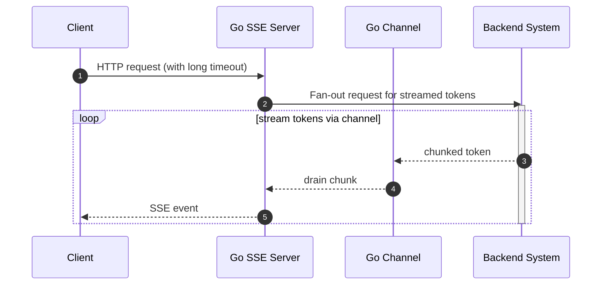
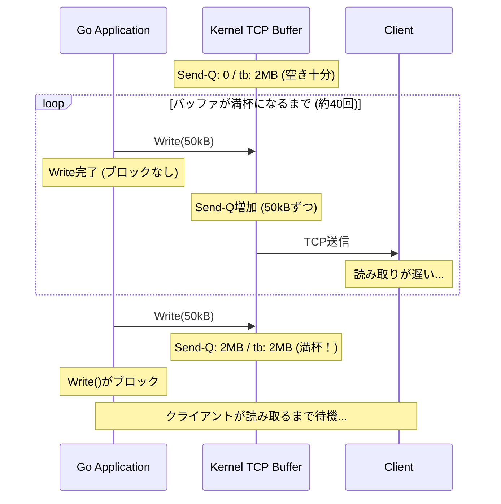

この記事は[Goアドベントカレンダー2025](https://qiita.com/advent-calendar/2025/go)に参加しています。

## はじめに
**SSE(Server-Sent Events)**、いろいろなところで見かけますね。

- LLMアプリケーションの実装例として紹介されていたり。
- AWS API GatewayがSSEに対応したり。

アドベントカレンダーのネタを考えた時、まず安直に「API GatewayがSSEに対応したのでGoでSSEサーバーを書いて試してみる」なんてことを考えたりもしました。
そのためにSSEについて改めて調べていたのですが、**「はて、次のようなケースはどうするのが良いのだろう？」** と気になりました。

それは次の図において**クライアントがサーバーからのレスポンスを読み出さない**場合です。(図中5)



SSEの特徴として、サーバーとクライアントの間には比較的長い時間コネクションを維持する(≒タイムアウト時間が長い)ユースケースが多いでしょう。そのため、コネクションを確立して、クライアントからリクエストが送られてきた後、サーバーからのレスポンスが読み出されないと長時間その状態が続き得ます。複数のクライアントとの接続で同じ現象が発生すると、終了しないgoroutineが増え、なかなかよろしくない状態になるのではないでしょうか？
また、各クライアントに返却するデータのソースが、近年のLLMのように高頻度・多トークンなデータを送信してくるものだと、データソースから受け取ったデータの送信待ちでヒープが増大するのではないでしょうか？

本記事では、SSEサーバーにおける、クライアント側のデータ読み出し遅延について実験をしてみます。

:::message
扱いたい問題は、調べてみると[ローアンドスロー攻撃](https://www.cloudflare.com/ja-jp/learning/ddos/ddos-low-and-slow-attack/)と近しいものに思われます。ただし本記事ではそうした明確な攻撃に限らず、クライアントの通信状態の悪さなどに起因する自然発生的な現象も含めて扱いたいと思うため、「クライアント側のデータ読み出し遅延」という長い呼び名で統一していこうと思います。
:::

## 本記事の対象読者
- SSEサーバーを実装してみようと思っている方
- SSEサーバーの実装経験・ノウハウをお持ちの方（アドバイザーとして）

## 本記事で扱う内容
- クライアント側のデータ読み出し遅延を模擬したSSEの実験をGo言語を用いた実装例とともに説明します。
- その前段として、サーバープログラムが応答を返す際のTCPソケットの働きも補足説明します。

## 本記事で扱わない内容
- SSEの詳細仕様。別の記事を参照ください。
  - https://html.spec.whatwg.org/multipage/server-sent-events.html
  - https://developer.mozilla.org/ja/docs/Web/API/Server-sent_events/Using_server-sent_events

## 前提条件
- Go1.24以上
- HTTP1.1 (ただしHTTP2でもエッセンスは同じ)
- TCPソケットの状態を確認できる`ss`のようなコマンドを実行できる環境

## 基準ケース：クライアントが正常にレスポンスを読み取る場合

今後の実験の基準として、まずクライアントが正常にSSEのレスポンスを読み取る場合を確認しておきます。

以下のような実装のサーバーを考えます。
- クライアントからリクエストを受けると、サーバーはさらにバックエンドのシステムに応答(トークン)の生成を依頼します。今回は簡単のため、一定時間間隔で固定トークン長の応答を返すものとします。
- サーバーとバックエンドシステム間では、ある程度非同期に処理を進めるため、バッファ付きチャンネルを介してデータを送受信します。
- サーバーはチャンネルを介してデータを取り出し可能になるたび、クライアントにSSEでレスポンスを送信します。

大まかな実装は以下の通りです。

```go
func startTokenStream(ctx context.Context, tokenBytes int) <-chan string {
    tokens := make(chan string, 100)
    go func() {
        defer close(tokens)
        ticker := time.NewTicker(50 * time.Millisecond)
        defer ticker.Stop()

        for {
            select {
            case <-ctx.Done():
                return
            case <-ticker.C:
                token := buildResponseToken(tokenBytes)
                select {
                case tokens <- token:
                case <-ctx.Done():
                    return
                }
            }
        }
    }()
    return tokens
}

func eventsHandler(tokenBytes int) http.HandlerFunc {
    return func(w http.ResponseWriter, r *http.Request) {
        w.Header().Set("Content-Type", "text/event-stream")
        w.Header().Set("Cache-Control", "no-cache")
        w.Header().Set("Connection", "keep-alive")

        flusher, _ := w.(http.Flusher)

        ctx := r.Context()
        tokens := startTokenStream(ctx, tokenBytes)
        log.Printf("client connected (payload=%d bytes)", tokenBytes)
        defer log.Println("client disconnected")

        for {
            select {
            case <-ctx.Done():
                return
            case token, ok := <-tokens:
                if !ok {
                    return
                }
                if _, err := fmt.Fprintf(w, "data: %s\n\n", token); err != nil {
                    return
                }
                flusher.Flush()
            }
        }
    }
}
```

このようなサーバーに対してクライアントからリクエストを送信すると、特に何事もなく処理が進みます。(サーバーが無限に応答を返してくるので、クライアント側で読み取るイベント数を制限したりしてください。)

では、このサーバーに対して、レスポンスの読み取りが遅いクライアントを繋いでみましょう。

## Badケース:クライアントがレスポンスを読み取らない場合

各イベントの読み取りごとの間隔を任意に設定可能なクライアントを定義し、同様にサーバーに接続してみます。

まずサーバーでは、一つのイベントで50kB程度のレスポンスを返すことにします。
```bash
# イメージ。完全なコードは付録に記載します。
go run ./sse-server -token-bytes=50000
```

影響を確認しやすいように、50個のクライアントを並列で接続します。

```bash
# イメージ。完全なコードは付録に記載します。
for i in $(seq 1 50); do
  go run ./slow-client -delay=10s &
done
wait
```

簡易的に`top`コマンドでサーバーの状態を確認してみます。`top`コマンドで、サーバープロセスのメモリー使用率を記録した結果をグラフ化したものがこちらです。

:::message
計測の都合上、0.5s程度アイドルタイムを含んだグラフになっている点はご容赦ください。
:::


開始から数秒はメモリー使用率は大きく上がりませんが、ある瞬間からメモリー使用率が急上昇し、あるところで飽和しています。なぜこのようなメモリー使用率の挙動になるのでしょうか。

カーネルのTCP送信バッファを確認してみると、この挙動に説明がつきます。`ss`コマンドを使用して各TCPソケットの状態を確認してみましょう。

```bash
# サーバーは:8080で動作しているものとします
watch -n 0.5 "ss -tm state established '( sport = :8080 )'"
```

すると以下のような様子が見えます。
```
Recv-Q   Send-Q   Local Address:Port      Peer Address:Port
0        972801           [::1]:http-alt         [::1]:40946
         skmem:(r0,rb131072,t0,tb2626560,f2687,w2000257,o0,bl0,d0)
```

- `Send-Q`: カーネルのTCP送信バッファに溜まっているデータの量(バイト数)です
- `tb`: カーネルのTCP送信バッファの上限(バイト数)です

Goにおいて、`http.ResponseWriter`の`Write`が完了するのは、データがカーネルのTCP送信バッファにコピーされた時点です。従ってカーネルのTCP送信バッファに空きがあれば、Goのプログラムとしてはデータを抱えないため、メモリー使用量がやたらと増えることはありません。

この動作を図示すると以下のようになります。



先ほどの実験においてはクライアントがデータを読み出す際に遅延が発生するため、徐々にカーネルの送信バッファにデータが溜まっていき、最終的には以下のように送信バッファが(ほぼ)いっぱいになります。

```
Recv-Q   Send-Q    Local Address:Port      Peer Address:Port
0        2593678           [::1]:http-alt         [::1]:40946
         skmem:(r0,rb131072,t0,tb2626560,f3442,w2630286,o0,bl0,d0)
```

この状態では、今回のようなサーバーの作りではカーネルのTCP送信バッファへの書き込みがブロックされる一方で、バッファ付きチャンネルを使っているためバックエンドからのトークン送信は止まりません。バッファの数 x トークンあたりのデータ x クライアントの数 の掛け算分だけヒープにデータが蓄積されていきます。これが先ほどのグラフにおいてメモリー使用量が急増していた領域です。

さらに実験を続けるとチャンネルのバッファもいっぱいになり、バックエンドからのトークン受信も止まります。先ほどのグラフにおいてメモリー使用量が横ばいになった領域です。

また補足ですが、メモリー使用量だけでなく、完了しないgoroutineの数も懸念となりますね。

SSEのようなストリーム処理の特徴(サーバーサイドの中で徐々にデータが積まれていく、タイムアウトを長く設定する)から、これらの課題が顕在化しやすいということがわかりました。では、このような課題を解消する方法を考えてみます。

## 改善案: 各書き込みに個別のタイムアウトを設定する

Go1.20から、`http.ResponseController`が追加されました。これを用いることで、通信全体のタイムアウトとは別に、各レスポンスごと(SSEにおいては各イベント送信ごと)のタイムアウトを設定することができます。(このAPIが追加された背景などについては、[こちら](https://future-architect.github.io/articles/20230128a/)を参照ください。)

先ほどのサーバー実装を少し変更することで`http.ResponseController`を適用可能です。

```go
func eventsHandler(tokenBytes int, writeTimeout time.Duration) http.HandlerFunc {
    return func(w http.ResponseWriter, r *http.Request) {
        w.Header().Set("Content-Type", "text/event-stream")
        w.Header().Set("Cache-Control", "no-cache")
        w.Header().Set("Connection", "keep-alive")

        flusher, _ := w.(http.Flusher)
        
        // 追加！
        rc := http.NewResponseController(w)
        ctx := r.Context()
        tokens := startTokenStream(ctx, tokenBytes)
        log.Printf("client connected (payload=%d bytes)", tokenBytes)
        defer log.Println("client disconnected")

        for {
            select {
            case <-ctx.Done():
                return
            case token, ok := <-tokens:
                if !ok {
                    return
                }
                // 追加！
                if err := rc.SetWriteDeadline(time.Now().Add(writeTimeout)); err != nil {
                    log.Printf("set deadline failed: %v", err)
                    return
                }
                if _, err := fmt.Fprintf(w, "data: %s\n\n", token); err != nil {
                    log.Printf("write failed: %v", err)
                    return
                }
                flusher.Flush()
            }
        }
    }
}
```

このサーバーに対して、先ほどと同じように、読み取り遅延があるクライアントを接続し、同様にメモリー使用率を確認してみます。

```bash
# イメージ。完全なコードは付録に記載します。
go run ./sse-improved-server -token-bytes=50000 -write-timeout=1s
```

メモリー使用率は以下のグラフのようになりました。


先ほどと同様にカーネルのTCP送信バッファがいっぱいになり、メモリー使用量が増えていきますが、カーネルのTCP送信バッファへの書き込みがブロックされた時点から1秒(WriteTimeout)が経過した時点でコネクションが切断されました。(GCで回収されていないのでメモリー使用率は減っていません)
狙い通りに、書き込みがブロックされた時点を起点として書き込みのタイムアウトが動作していることが確認できました。

今回の実験のようなサーバー実装では、イベントごとのタイムアウトは設定しておいた方が堅牢になることがわかりましたね。

## おわりに
今回の実験では、クライアントの読み出し遅延があるだけでヒープが一気に逼迫するケースを取り扱いました。「遅いクライアントがありえる」という前提はうっかり忘れることがありますが、今回実験したようなケースではサーバーのパフォーマンス問題となり得るため、十分にケアして設計をする必要がありますね。

本記事では、`http.ResponseController`の`SetWriteDeadline`のような仕組みを使い、イベント送信ごとのタイムアウトを設けることで一定の対策が可能な目処も立ちました。今後の実装に活用していきたいと思います。

## 付録1
本記事を記載するにあたり文献を調査しましたが、こうした現象は"back pressure"と呼ばれるのですね。

例えばNode.jsにおいてはどのようにバックプレッシャー対策をしているか解説されていました。

https://nodejs.org/en/learn/modules/backpressuring-in-streams

## 付録2
実験に使ったコードは以下のGitHubリポジトリに公開しました。
https://github.com/tenkoh/example-go-backpressure
