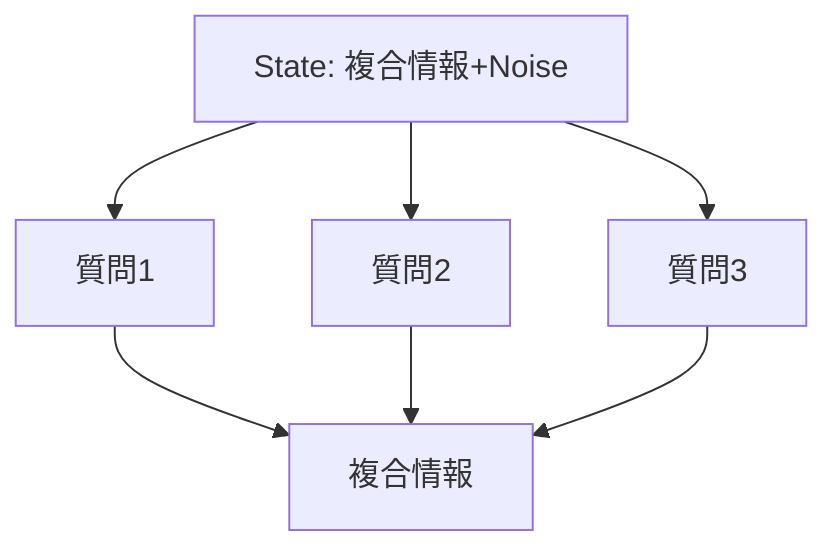

## はじめに

[TypeSafe](https://typesafe.ai) のモデル「Jev」が発表され、コミュニティで多様な活用事例が報告されています。
Jev が注目を集めている背景には、大規模言語モデル（LLM）と比較した際の応答速度の速さ、利用コストの低さ、そして出力が構造化されていてプログラムから扱いやすいという特性があります。

一方で、テキスト生成を行う従来の LLM とは根本的に性質が異なるため、具体的なユースケースの着想には工夫が要ります。特性を理解するには、実際に動くアプリケーションを構築して検証するのが確実でしょう。

本記事では、Jev の特性である「1つの入力に対して複数の質問を並列評価し、高速に応答を取得できる点」を Generative UI に適用した実験結果を共有します。次の動画のように、ユーザーの自然言語による指示に応じて、ダッシュボードの表示要素を即座に切り替えるインターフェースを実装しました。


デモ環境：https://generative-dashboard.jevpoc.tenkoh.dev/

## 対象読者

- Jev の仕様や特徴に興味があり、具体的な活用方法を調べている開発者

## Jev の基本仕様と設計パターン

### 入出力の基本構造

Jev の基本的な入出力の仕組みを確認します。
Jev は、入力テキストに対する質問を評価し、構造化された判定結果を返すモデルです。入力となるテキスト(**State**)、それに対する個々の問い(**Questions**)を組み立て、モデルの評価結果を得ます。

State には、質問の評価対象となる自然言語のテキストを渡します。

```text:State
昨日は朝食を食べなかった
```

Questions では、質問形式（`type`）と質問内容（`instructions`）を指定します。複数の質問を一度のリクエストに含めて送信できます。

```json:Question
{
  "breakfast": {
    "type": "noul",
    "instructions": "朝ごはんを食べた？"
  },
  "lunch": {
    "type": "noul",
    "instructions": "昼ごはんを食べた？"
  },
  "dinner": {
    "type": "noul",
    "instructions": "夜ごはんを食べた？"
  }
}
```

このリクエストに対して、次のような構造の応答が返ります。

```json:Answer
{
  "model": "jev-1.13.0",
  "answers": {
    "breakfast": {
      "type": "noul",
      "noul": 0.03,
      "stats": {}
    },
    "lunch": {
      "type": "noul",
      "noul": 0.68,
      "stats": {}
    },
    "dinner": {
      "type": "noul",
      "noul": 0.68,
      "stats": {}
    }
  },
  "usage": {
    "input_tokens": 319,
    "output_tokens": 56
  },
  "evaluation_time_ms": 111.2874240061501
}
```

今回は質問形式に `Noul` を指定したため、各質問に対する確信度（Yes の度合い）が 0〜1 の数値として返ります。上記の入力文には昼食や夕食に関する情報が含まれていないため、モデルの判定値も中間的な数値（0.68）を示しています。

ここで State を次のように変えてみます。

```text:State
昨日は3食のうち朝食のみ食べなかった
```

得られる応答は次のように変化します。

```json:Answer
{
  "answers": {
    "breakfast": {
      "type": "noul",
      "noul": 0.03,
    },
    "lunch": {
      "type": "noul",
      "noul": 0.92,
    },
    "dinner": {
      "type": "noul",
      "noul": 0.91,
    }
  }
}
```

昼食と夕食を食べたことが文脈から推論され、それぞれの数値が 0.9 以上に上昇しています。

Jev がサポートする質問形式は主に次の3種類です[^structure]。

| 形式 | 概要 |
| --- | --- |
| **Noul** | Yes / No の二値判定（0〜1 の確信度を返す） |
| **Choice** | 定義した複数の選択肢からの分類 |
| **Score** | 定義した指標に基づくスコア算出 |

[^structure]: 公式ドキュメントにはこれらと並列に `Advanced: structure` の記載もありますが、各形式の記述を構造化するための詳細指定であるため、ここでは割愛します。

Jev はしばしば「高度な if 文」と表現されます。これは、入力されたテキストに対して事前学習なし（Zero-shot）で条件判定を行い、確信度付きの構造化データを返すためです。上記の実行例でも、サーバー側の処理時間は約 111 ms であり、テキストを逐次生成する一般的な LLM に比べて高速に応答が得られます。

### Cookbook に見る設計パターン

Jev の実践的な活用方法を把握するため、公式サンプル集（Cookbooks）の設計を確認しました[^cookbooks-index]。

[^cookbooks-index]: [Consistency Choice Cookbook](https://docs.typesafe.ai/cookbooks/consistency_choice_cookbook) などを参照してください。執筆時点では Cookbook 全体のインデックスページが用意されていないため、個別のサンプルページへのリンクを記載しています。

これらの事例から読み取れるのは、「1つの State に対して直交する軸で複数の質問を投げ、得られた結果を束ねて後続処理を分岐させる」という設計パターンです。



LLM と比較した大きな特徴は、質問ごとに個別の信頼度（Confidence）が得られる点にあります。信頼度の高い項目はそのままプログラムの処理に反映し、信頼度が低い項目に限定してユーザーに再確認を求めるといった、きめ細かなフォールバック制御を容易に組み立てられます。

## Generative UI への適用

### アプリケーションの要件と構成

前述の設計パターンを活かす題材として、Generative UI を実装しました。

目指したのは、「ユーザーが自然言語で入力した指示に応じて、画面上の表示要素をその場で動的に組み替える」機能です。
先行事例として azukiazusa さんによる [json-render と Jev で UI を組み立てる試み](https://azukiazusa.dev/blog/json-render-jev/) がありますが、本記事ではユーザーの対話的操作に応じたコンポーネント構成のリアルタイムな組み替えに焦点を絞っています。

UI の動的再構成を行うシステムには、ユーザーを待たせないミリ秒単位の応答性、多様な表示要素やパラメータを正しく仕分ける分類精度、そして頻繁な操作を許容できる低コスト性が求められます。高速かつ安価で構造化出力を返す Jev の特性は、これらの要件に適しています。

検証用として、表示要素の柔軟な入れ替えが求められるダッシュボードアプリケーションを実装しました。

- デモ環境：https://generative-dashboard.jevpoc.tenkoh.dev/
- ソースコード：https://github.com/tenkoh/jev-playground/tree/main/generative-dashboard

:::message
デモ環境は検証用クレジットで運用しているため、アクセス状況によっては一時的に停止する場合があります。
:::

### 内部での判定処理

実装にあたっては、Claude Code（`typesafe-ai/skills` を導入）を用いてプロトタイプを構築しました。

Jev の高い応答性により、入力の送信から画面の再描画まで軽快に追従します。

内部の処理としては、ユーザーが入力した自然言語のプロンプトを State とし、次のように直交する複数の質問を Jev に送信しています。

- **操作種別の特定**：全要素の置き換えか、特定要素の追加や削除か
- **対象要素の特定**：操作対象となるメトリクス（データベースの CPU 使用率、メモリ使用量など）
- **表示期間の特定**：表示対象の時間範囲（過去24時間、直近1週間など）

アプリケーションは、得られた回答の組み合わせをもとに画面の状態を更新します。
質問に対する回答の信頼度がしきい値を下回る場合には、推測される候補を提示してユーザーに選択を求める設計とし、意図しない画面更新を防いでいます。

## 考察

今回の試作を通して、Jev をアプリケーションに組み込む際の利点が明確になりました。

- **API コストの低さ**：プロトタイプ作成中に約120回のリクエストを送信しましたが、費用は 0.05 ドル程度に収まりました。UI 操作のように頻繁にリクエストが発生する用途でも運用コストを低く保ちやすいでしょう。
- **分類器としての堅牢性**：Jev は入力を指定したスキーマへ分類する処理に特化しています。自由文を生成する LLM とは異なり、プロンプトインジェクションへの懸念を抑えやすく、出力形式の逸脱も起きにくいため、既存のシステムコンポーネントとして安全に組み込みやすい構造と言えます。

Jev は自由な対話ではなく、曖昧なテキストから確定的な意図やパラメータを高速に抽出する用途で真価を発揮します。高速な意味的分類器としてフロントエンドの制御ロジックに組み込むことで、LLM 単体では難しかった応答性の高いユーザー体験を実現できると感じました。
