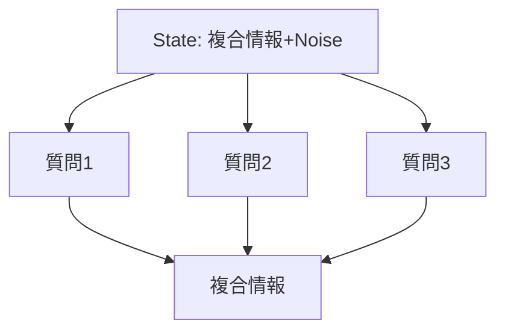

## はじめに
[TypeSafe](https://typesafe.ai) のフラッグシップモデル Jev が発表されて数日、次々と活用事例が登場し、大いに盛り上がっています。

これだけ Jev が注目を集める理由は、LLMに比べて **応答速度が早い**、**価格が安い**、**出力が構造化されていてプログラムから扱いやすい** の3点が揃っていることだと私は思います。ただ、慣れ親しんだ LLM とは特性が大きく異なるため、Jev の特徴を知っていても、何に使えば良いのか、何に向いているのかを発想することには壁があるのではないでしょうか。この壁を突破する鍵は、とにかく触って試してみることでしょう。

本記事では、Jev の特徴「1つの入力に複数の質問ができ、高速に応答を取得できる」を Generative UI に活用することを試した結果を共有します。こちらの動画のように、**自然言語でダッシュボードに表示する要素の切り替えを素早く行うことができ**、なかなか面白い体験が提供可能だと考えました。


## 対象読者
- Jev に興味があり、活用方法について情報収集している技術者

## Jev 活用方法概論
### Jev Basics
本題に入る前に、Jev の最も基本的な使い方に触れておきます。既に Jev の使い方をご存知の方は、この節は読み飛ばしてもらっても構いません。

Jev は、State に対する質問に、構造化された応答を返します。例えば以下のような形式です。

State は、質問の評価対象となる入力です。
```text:State
昨日は朝食を食べなかった
```

質問は、`type` によって質問形式を定め、`instructions` によって質問の内容を記述したものです。複数の質問を一度に送ることができます。
```json:Question
{
  "breakfast": {
    "type": "noul",
    "instructions": "朝ごはんを食べた？"
  },
  "lunch": {
    "type": "noul",
    "instructions": "昼ごはんを食べた？"
  },
  "dinner": {
    "type": "noul",
    "instructions": "夜ごはんを食べた？"
  }
}
```

得られる応答は以下のようなものです。
```json:Answer
{
  "model": "jev-1.13.0",
  "answers": {
    "breakfast": {
      "type": "noul",
      "noul": 0.03,
      "stats": {}
    },
    "lunch": {
      "type": "noul",
      "noul": 0.68,
      "stats": {}
    },
    "dinner": {
      "type": "noul",
      "noul": 0.68,
      "stats": {}
    }
  },
  "usage": {
    "input_tokens": 319,
    "output_tokens": 56
  },
  "evaluation_time_ms": 111.2874240061501
}
```

今回は `Noul` 形式の質問にしたので、各質問に対する Yes の度合い(0~1)が返ってきました。先程の State は確かに「昼ごはん、夜ごはん」をどうしたか読みとれない文章のため、やや決めかねている数値が返ってきています。少し State を変えてみると結果が変化します。

```test:State
昨日は3食のうち朝食のみ食べなかった
```

```json:Answer
{
  "answers": {
    "breakfast": {
      "type": "noul",
      "noul": 0.03,
    },
    "lunch": {
      "type": "noul",
      "noul": 0.92,
    },
    "dinner": {
      "type": "noul",
      "noul": 0.91,
    }
  }
}
```

質問は以下の3つの形式があります。
| 形式 | 概要 |
| --- | --- |
| Noul | Yes / No で回答 |
| Choice | ユーザーが決めた複数の選択肢から回答 |
| Score | ユーザーが決めたスコア指標に基づくスコアを回答 |

Note: 公式ドキュメントでは、これらと並列に `Advanced: structure` の記載がありますが、各質問形式の詳細記述方式だと私は理解したので、上の表には含めていません。

**Jev は高度な If 文**のようなものと言われるのを見かけますが、そのとおりで、Zero-shot で　State を質問に当てはめて評価した結果が得られます。先程の質問の場合は、サーバータイムで 111ms で応答が得られており、LLMと比較して高速であることも嬉しいですね。

基本が分かったところで次に進みます。

### Jev Cookbook
いきなりオリジナリティを追い求めたいところですが、私はなかなか手が動きませんでした。そこで公式サンプル集に目を通して、Jev　は具体的にどのような活用方法を想定されているかを確認することにしました。

Cookbooks の一例です。
https://docs.typesafe.ai/cookbooks/consistency_choice_cookbook

:::message
余談ですが、cookbooks 一覧を表示するページが無いので、リンクが貼りづらいですね…。
:::

これらの例から、**１つの State に対して、独立した軸で複数の質問を行い、結果を束ねて後続の処理に使う**、というパターンが伺えてきました。



LLM と比較して面白いのは、独立した軸で複数の質問を行うと質問ごとに Confidence が得られるため、確度が高い結果はそのまま採用する、確度が低い場合はユーザーに問い合わせるという使い方もできる点です。

次の章では、ここまでに分かった Jev の特徴を活用可能なアプリケーション例を考えて試してみます。

## Generative UI に適用してみる。
本記事では、Jev を Generative UI に活用してみることにします。特に「アプリケーション上で、ユーザーの自然言語による指示により、その場で画面の表示要素を変化させる」ことを達成してみます。既に azukiazusa さんが　[json-render と Jev で UI を組み立て](https://azukiazusa.dev/blog/json-render-jev/)る試みをされていますが、少し違う角度で、その場でユーザー指示によって UI を組み替えようというものです。

このアプリケーションは、高い応答性で、多様な表示要素・プロパティの組み合わせを的確に処理し、かつ気軽に活用可能なように安価に実行できることが必要です。まさに Jev 向きなのではと考えました。

出来上がったものがこちらです。いろいろな要素の組み合わせをその場限りで入れ替えたいアプリケーションの代表例としてダッシュボードとして実装しました。
https://generative-dashboard.jevpoc.tenkoh.dev/

:::message
Jev の初期配布クレジットで動かしているので、アクセスをたくさん頂くと止まる可能性があります。
:::

ソースコードはこちら。
https://github.com/tenkoh/jev-playground/tree/main/generative-dashboard

`typesafe-ai/skills` を導入した Claude Code にコンセプトを伝えてざっと実装したものですが、想像以上にキビキビと UI を切り替えてくれるアプリケーションが出来上がりました。 Jev の応答性の恩恵を感じます。

内部実装としては、ユーザーが入力した自然言語に対して、「期待する操作(要素全体の置き換えか、特定要素の削除か等)」「操作したい要素(例: RDBのCPU使用率)」「表示したい時間範囲」などの直交する質問を行い、各質問の結果を使って画面を切り替えています。もし質問に対する回答の信頼度が低い場合は、候補を提示したうえでユーザーに決定を求めるようにしています。

## 所感
- とにかく API 料金が安い。120回呼んで $0.05 程度です。
- LLMに対して行われるプロンプトクラッキングを恐れずにサービスを公開できる。「特に現状は」という枕詞が必要かもしれませんが、Jev 自体は分類器の働きしかせず、また応答も開発者主導で定義できるため、アプリケーションの一部品として組み込みやすいと感じました。

一つの例を作ったところ、使い所の感覚が掴めてきたように感じられています。他にも作ってみたいものが出てきたので、今のうちにいろいろ遊んでみようと思います。
