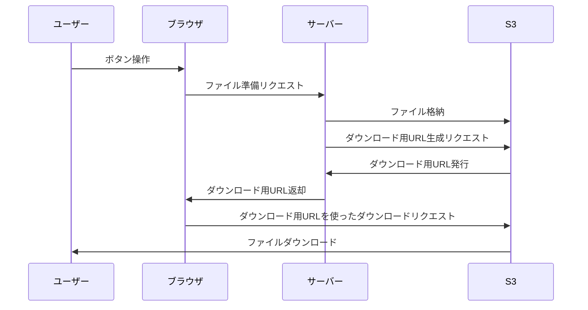

## この記事は何
フロントエンドの操作で複数ファイルを一括ダウンロードさせたかった時に、少しの躓きと気づきがあったので紹介します。

## 前提
- ブラウザはGoogle Chromeとします。他環境での動作は確認できていません。
- 想定するシーンは、**ユーザーがブラウザ上でボタン操作を行うと、サーバーが裏でファイルを準備してS3に格納＆ダウンロード用URLを生成してブラウザに返却し、ブラウザがそのURL先のファイルをダウンロードする**、とします。ファイルは1つにまとめられておらず、**複数ファイルを(ほぼ)同時にダウンロード**します。
  - サーバーサイドでファイルを1つにまとめておくのが親切かと思いますが、本記事ではそれはスコープ外とします。

1つのファイルをダウンロードする際の概要を図にすると以下のとおりです。


本記事では、一度のボタン操作で複数回同じファイルをダウンロードすることにして説明します。

## 結論
- JavaScriptで`<a>`を差し込んでクリックさせる方法は、連続するとブラウザ側でキャンセルされることがある。
- JavaScriptで`<iframe>`を差し込み`sandbox=allow-downloads`としてあげれば連続ダウンロードが可能。

## はじめに：フロントエンドでのダウンロード常套手段
[フィーチャー技術ブログ](https://future-architect.github.io/articles/20220621a/#%E3%83%96%E3%83%A9%E3%82%A6%E3%82%B6-JavaScript%E3%81%A7%E5%BC%B7%E5%88%B6%E3%83%80%E3%82%A6%E3%83%B3%E3%83%AD%E3%83%BC%E3%83%89%E3%82%92%E8%A1%8C%E3%82%8F%E3%81%9B%E3%82%8B)さんに大変わかりやすい記事があります。フロントエンドでJavaScriptを使って強制的にファイルをダウンロードさせるには、アンカー`<a>`を作り、それをクリックさせる方法が使えます。

```javascript:sample
const anchor = document.createElement('a');
anchor.href = 'link/to/file';
anchor.download = 'file';
anchor.style.display = 'none';
document.body.appendChild(anchor);
anchor.click();
URL.revokeObjectURL(anchor.href);
document.body.removeChild(anchor);
```

この方法はシンプルで、単体ファイルダウンロードであればしっかりと動作します。

ところがこの方法で2つ以上のファイルをダウンロードさせようとすると**最後のファイルしかダウンロードされない**状況に遭遇します。(注:ダウンロードされる数は環境に依存する可能性があります。)

ためしに2つのファイルをダウンロードした際に、ブラウザの開発者ツールを開くと以下のようになっていました。


キャンセル済み…？Google Chromeの仕様でしょうか。連続したアンカークリック動作がキャンセルされているようです。確かな出典は探せていませんが、同じような状況はパラパラと確認できます。

https://stackoverflow.com/questions/52051330/browser-is-cancelling-multiple-file-download-requests

上記の記事には同時に解決策も示されているのですが、本記事では、せっかくなので暫定的な対処方法も含めて順に示したいと思います。

## 暫定対策：ダウンロード間に待ち時間を設ける
各ダウンロード間に待ち時間を設ければ、先ほどのようなブラウザによるキャンセルは発生しませんでした。

```javascript:ダウンロード間に待ち時間を設ける
for (let i = 0; i < downloadNum; i++) {
    const anchor = document.createElement('a');
    anchor.href = 'link/to/file';
    anchor.download = 'file';
    anchor.style.display = 'none';
    document.body.appendChild(anchor);
    // 1秒間隔をあけてダウンロードする
    setTimeout(() => {
        anchor.click();
        URL.revokeObjectURL(anchor.href);
        document.body.removeChild(anchor);
    }, i*1000);
}
```

ただしこの方法はフレーキーでした。ファイルサイズが大きい場合には1秒間隔でもダウンロードがキャンセルされることがありました。

## 対策：iframeを使う
先ほどの記事にもあったように、iframeを使うことで安定して複数ダウンロードを行うことができました。

```javascript:iframeを使う方法
for (let i = 0; i < downloadNum; i++) {
    const iframe = document.createElement('iframe');
    iframe.src = "link/to/file";
    iframe.style.display = 'none';
    iframe.sandbox = 'allow-downloads';
    document.body.appendChild(iframe);
}
```

ダウンロードが完了した時点でiframeを消してあげるのが一番良いと思いますが、上記サンプルにはそこまで入れ込んでありません。

なお、Safariは`sandbox=allow-downloads`に対応していないため上記方法は使えません。

https://developer.mozilla.org/en-US/docs/Web/HTML/Element/iframe#browser_compatibility

## 最後に
- 比較的シンプルにやりたいことが実現できました。
- アンカーを使う方法でダウンロードがキャンセルされるChromeの仕様をちゃんと出展を見つけたいと思います。
