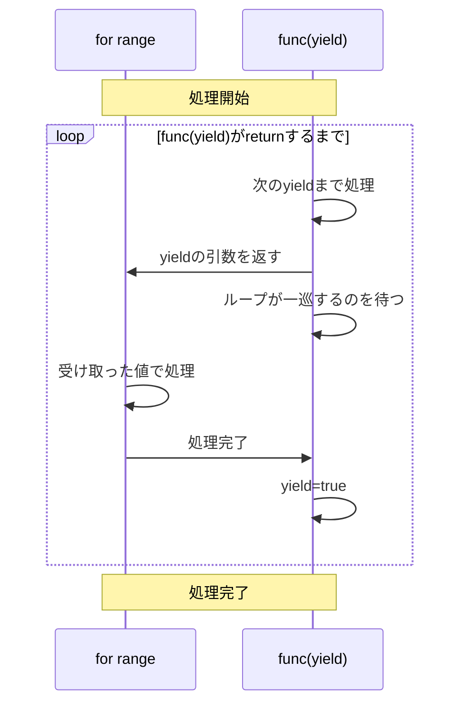
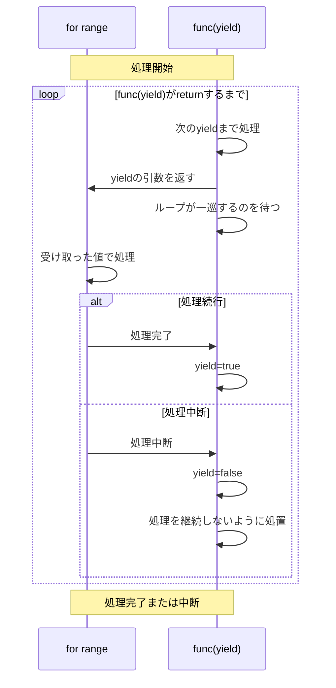

## この記事は何
Go1.23から正式に導入される`range over func`、Go1.22で実験的に導入された頃から数えると、結構な時間が経ちましたね。既に慣れ親しんでいる方も多くいらっしゃると思いますが、**恥ずかしながら私はまだです…。** お作法を理解できていないのが原因かと思います。

これではいけない！と、最近、一念発起して`range over func`に向き合ってみたので、私と同じようになかなか慣れられない方向けに記事を書きたいと思います。

## この記事で扱うこと、扱わないこと
- `range over func`の導入に至る背景や解決したい課題に関する説明は行いません。
- `range over func`を使ってみよう！と意気込めるように、最低限押さえておきたいポイントを筆者の主観ベースでまとめた内容を紹介します。本機能の設計意図や言語仕様などを完璧に汲んだ説明は目指しておらず、**あくまで「使い始める」を目標にした入門ドリルの位置付け**です。

## この記事の対象読者
- Goの基本は履修済みだけど、`range over func`まだ全然慣れてない！というGopher。

## 前提
- GoのバージョンはGo1.23rc2であるとします。

## この記事の構成
**まず`range over func`を使い始めることを目的に、覚えておきたいポイントを説明する形式で進めます。**

なお、ここからはストーリーテラーとして「ごふちゃん」というキャラクターを召喚してみます。


:::message
このキャラクターはRenee Frenchが著作権を保持するGopherのコンテンツをベースに著者が作成したものであり、クリエイティブ・コモンズの表示3.0のライセンス(the Creative Commons 3.0 Attribution License)に記載の条件のもとで使用しています。http://creativecommons.org/licenses/by/3.0/ https://go.dev/doc/gopher/README
:::

それでは始めましょう！

## まず覚えること
ごふちゃん「今日勉強する`range over func`だけど、『**これはこういうものだ！**』と覚えないと始まらないことがいくつかあるよ。いっしょに覚えていこうね。」

### rangeにfunc??
ごふちゃん「まずおさらいだけど、これまでの`range`の使い方といえばこういう感じだよね。」

```go
for i, v := range []int{100, 200, 300} {
    fmt.Printf("iteration:%d, value:%d\n", v)
}
// output
// iteration:0, value:100
// iteration:1, value:200
// iteration:2, value:300
```

ごふちゃん「なんでこの構文でこういうことができるんだろう？っていうのは、正直『そういうものだよね』って覚えちゃうしかないよね。`range over func`も同じ位置付けで、まずそういうもんだ！と覚えちゃうしかないよ！私のおすすめはGo Specの表をまずじーっと眺めてみることかなぁ。」

https://github.com/golang/go/blob/c9940fe2a9f2eb77327efca860abfbae8d94bf28/doc/go_spec.html#L6664-L6673

- `range func(func() bool)`は値を何も返さない。`for range ...`みたいな感じで使うんだね。
- `range func(func(V) bool)`はVを返す。`for x := range ...`みたいな感じで使うんだね。
- `range func(func(K, V) bool)`はK, Vを返す。`for i, x := range ...`みたいな感じで使うんだね。

「いままで馴染みがあるスライスやマップと横並びで見ると、ちょっと挙動を理解しやすくないかな？」

### `func(V) bool`みたいなのは結局どこで何をするの??
ごふちゃん「さっきのGo Specで出てきた`range`の使い方で、どんな値を引き出せるのかはわかったけど、具体的にどうやって使うのかな？ここでは例を挙げて考えてみるよ。1つ値を返す関数を例にしてみるね。」

https://goplay.tools/snippet/zwVr7t1RxUL

```go
package main

import (
   "fmt"
   "time"
)

func main() {
   for x := range f {
   	fmt.Printf("loop=%d, begin\n", x)
   	time.Sleep(3 * time.Second)
   	fmt.Printf("loop=%d, end\n", x)
   }
}

func f(yield func(int) bool) {
   fmt.Println("start...")
   yield(1)
   fmt.Println("midway...")
   yield(2)
   fmt.Println("finish!")
}
```

「これを実行すると、こんな出力が得られるよ。分かりやすくするために`time.Sleep`を入れたところがあるから、時間での区切りを補記してあることに注意してね。」

```text
start... 
loop=1, begin

(ここで待機)

loop=1, end
midway...
loop=2, begin

(ここで待機)

loop=2, end
finish!
```

「ここで覚えておくポイントは次のことかな。」

- 慣例的に`yield`という名前の関数を使うことが多くなりそうだよ。別に予約語とかではないので深読みしなくて良いよ。yieldは他の言語を使ったことがある人は見覚えがあるかもしれないね。
- `yield`の型は`func(int)bool`だから、`f(yield)`がGo Spedで言うところの`function, 1 value`にあたるね。ということは`range`に渡せて、`yield(1)`ってすると`1`が渡せる/飛び出してくるはずだね。

「まだ分かりづらいだろうから、図を使って呼び出しの順序について確認してみるね。」

:::message
ここからは、まず処理の順序を直感的に理解するための説明になります。正確な言語仕様との齟齬がある場合、当然言語仕様が正ですので、詳細な挙動に関心のある方は言語仕様をご確認ください。このような位置付けの記述を好まれない方はそっとタブを閉じてください。
:::

「まず、処理全体の流れは次のようになっているよ。」



「`for range`ループに入ると、最初の`yield`まで`f(yield)`内の処理が進んで、最初の`yield`の引数がループ変数に渡されるよ。さっきのコードだと、`start...`って表示するのと`yield(1)`するまでの部分だね。」

「ここでいったん`f(yield)`の処理は止まるよ。`for range`は受け取った値を使ったりしながらループ内の処理を進めるよ。」

「思い出してみると`yield`は`func(string)bool`だから`bool`を返すんだけど、この例のように`for range`のループが一周終わると`true`を返すよ。さっきのコードだと`yield(1)=true`ってことだね。**これはそういうもの！** って覚えてしまうのが早いかな。」

「ループが一周終わったので、`f(yield)`の中で次の`yield`まで処理が進むよ。さっきのコードだと`midway...`って表示して、`yield(2)`するところまでだね。こんなふうに、`f(yield)`が終了するまで処理を繰り返していくよ。」

「`for range`内の２周目の処理が終わると、`f(yield)`は`finish!`を表示して`return`するよ。`return`されてこれ以上値が出てこないので`for range`ループ全体が終了するんだね。」


:::message
プチまとめ：`for range`のループ変数には`yield`の引数が渡される。`yield`自体も値を返すが、ループが一周したら戻り値は`true`。
:::

「`range over func`の基本的な動きはこんな感じだよ。これは覚えちゃおうね。」

### `func(V) bool`の戻り値って??
ごふちゃん「`func(V) bool`の`bool`って何なの!?って引っかかった人も多いんじゃないかな？さっきの例で、`for range`が一周したら`true`っていう説明はしたよね。じゃあ次は、`false`になるのはどんな時かを覚えようね。」

「さっきの例を一箇所変更してみるね。」

```diff go
package main

import (
	"fmt"
	"time"
)

func main() {
	for x := range f {
		fmt.Printf("loop=%d, begin\n", x)
		time.Sleep(3 * time.Second)
		fmt.Printf("loop=%d, end\n", x)
+		break
	}
}

func f(yield func(int) bool) {
	fmt.Println("start...")
	yield(1)
	fmt.Println("midway...")
	yield(2)
	fmt.Println("finish!")
}
```

「これを実行してみると…？」

```text
start...
loop=1, begin

（ここで待機）

loop=1, end
midway...
panic: runtime error: range function continued iteration after function for loop body returned false
```

「あらら、panic になっちゃったね。理由は読めば分かるけど、`for range`が中断されたのに`f(yield)`内の処理が続いているのはダメなんだね。どう対処すればいいんだろう？…ここで`yield`の戻り値を使っていくよ。」

「さっきのコードをまた少し変更するね。」

```diff go
package main

import (
	"fmt"
	"time"
)

func main() {
	for x := range f {
		fmt.Printf("loop=%d, begin\n", x)
		time.Sleep(3 * time.Second)
		fmt.Printf("loop=%d, end\n", x)
		break
	}
}

func f(yield func(int) bool) {
	fmt.Println("start...")
-	yield(1)
+	if !yield(1) {
+		fmt.Println("break!")
+		return
+	}
	fmt.Println("midway...")
	yield(2)
	fmt.Println("finish!")
}
```

「これを実行すると…？」

```text
start...
loop=1, begin
loop=1, end
break!
```

「今度は panic せずに終了したね。この例から分かるように、`for range`のループが`break`などで中断されると`yield=false`になるよ。これも覚えておくポイントだね。」

「処理全体の流れに、ループを中断した場合も追記したよ。」



:::message
ループが中断したら`yield`の戻り値は`false`。
:::

「`yield`の戻り値が何を意味するのかと、終了処理のお作法についてわかってきたかな？？」

「まず覚えないといけないことはここまでだよ！」

## おわりに：この先の学び方
ごふちゃん「一緒に勉強してみてどうだった？意外と覚えることは少なかったんじゃないかな？これで`range over func`の基本は理解できたと思うから、この後は`range over func`を使って実現できる面白いことを色々探してみてね！」

⭐️ぜひ読みたい記事たち⭐️
- https://future-architect.github.io/articles/20240718a/
- https://github.com/golang/go/issues/61898

